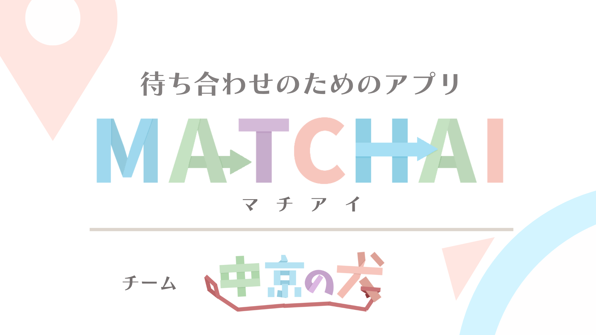
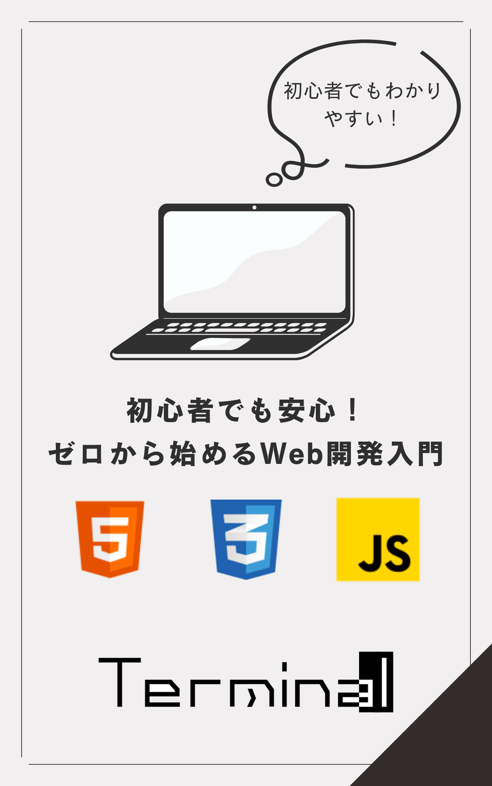
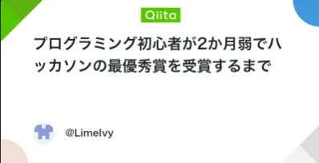

<!-- Typing SVG -->

### 🚀 Full Stack Developer | 🎨 Web Application Developer

**学生エンジニア**として、Webアプリケーション開発の学習をしています！

 

<!-- ソーシャルリンク -->

---

## 📝 About Me

- 学生エンジニアとして、フルスタック開発を学習中です！
- 普段は、Next.jsを用いたモダンなWebアプリケーション開発を行っています！
- サークルでの勉強会のために、React,Gitなどの技術記事の執筆を行うことで学習内容をアウトプットしています！

 

## 💻 Skills

### Frontend

  

### Backend

  

### Tools

  

 

## 📊 GitHub Insights

  
  

<!-- Activity Graph -->

---

## 🚀 Featured Projects

<table>
  <tr>
    <td width="50%" valign="top">
      <h3 align="center">MATCHAI</h3>
      

        
        

          
        

        
<strong>位置情報を用いた待ち合わせ簡易化アプリ</strong>

        

          <strong>技術スタック:</strong> Next.js, TypeScript, TailwindCSS
        

        

          
<strong>詳細を見る</strong>

          

            <strong>役割:</strong> バックエンド側の開発 
            <strong>実装箇所:</strong> 位置情報APIの実装、距離や高さの計算やチャットのリアルタイム更新などを実装 
            <strong>受賞歴:</strong> SysHack2025最優秀賞&企業賞(TechTrain様) 
            技育博2025 vol.2 サイバーエージェント賞
          

        

      

    </td>
    <td width="50%" valign="top">
      <h3 align="center">わ～どせんす</h3>
      

        
        

          
        

        
<strong>リアルタイム日本語カードゲーム</strong>

        

          <strong>技術スタック:</strong> Next.js, Convex, word2vec
        

        

          
<strong>詳細を見る</strong>

          

            <strong>役割:</strong> 個人開発 
            <strong>実装箇所:</strong> convexを用いたリアルタイム通信、DB設計、効率的なデータフェッチ 
            <strong>受賞歴:</strong> 技育展2025予選通過
          

        

      

    </td>
  </tr>
</table>

---

## 🏆 Achievements

| イベント | 賞 | プロダクト | 月 |
|---------|---|------------|---|
| **SysHack2025** | 最優秀賞 & 企業賞 | [MATCHAI](https://github.com/yama4936/MATCHAInext) | 2025/03 |
| **技育博2025 vol.2** | サイバーエージェント賞 | [MATCHAI](https://github.com/yama4936/MATCHAInext) | 2025/05 |
| **技育展2025** | 予選通過 | [わ～どせんす](https://github.com/LimeIvy/word-sence-frontend) | 2025/11 |

## ✍️ Recent Articles

<table>
  <tr>
    <td width="50%" valign="top">
      

        
        

          
        

        
Web開発の基礎を学ぶための入門書

      

    </td>
    <td width="50%" valign="top">
      

        
        

          
        

        
Reactの基礎から実践までを解説

      

    </td>
  </tr>
</table>

<!-- Qiitaの記事 -->

  
  

    
  

  
ハッカソン挑戦の体験談

➡️ [もっと記事を読む](https://qiita.com/LimeIvy)

---

 

  

